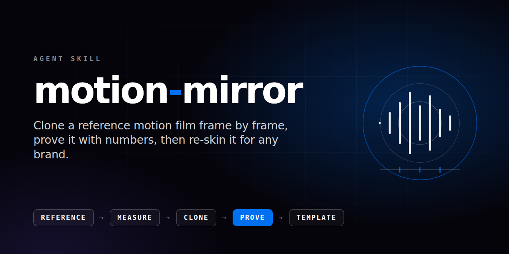
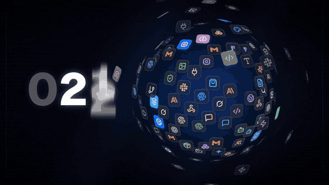

<p align="center"></p>

<p align="center">
  <a href="LICENSE"></a>
  <a href="https://github.com/christopher-lasgi/motion-mirror/actions/workflows/check.yml"></a>
  <a href="https://github.com/christopher-lasgi/motion-mirror/releases"></a>
</p>

<p align="center"><b>English</b> · <a href="README.fr.md">Français</a></p>

# motion-mirror

An agent skill that teaches a coding agent to clone a reference motion-design video (shot timing, choreography, décor, transitions, sound placement), **prove** the clone with measured gates, lock it scene by scene, then turn it into a template any brand can re-skin and decline in 16:9, 9:16, 1:1, 4:5 and other locales.

Without a method, an agent invents its own choreography, eyeballs timing and shows you a video you have to argue with. With this skill it works from timecoded boards, measures the gap against the reference with numbers, and hands you a side-by-side proof you can annotate.

## Demo

<p align="center"></p>

Made with this skill: the 30 second launch film of [Orbit](https://orbit.easyconnector.app), 16:9 excerpt shown. Picture and score are generated by code; no third-party footage or music is used.

▶ **[Watch the full film with sound](assets/demo-16x9.mp4)** (16:9, 30 s) · [Storyboard and shot list](showcase/README.md)

<p align="center"></p>

The same film as a 9:16 cut: re-blocked from the same timeline and the same score, never a crop.

## What you get

- **A pipeline** from ingest to declines: shot map, inventory per shot, one events table shared by picture and sound, one scene at a time, lock, assembly.
- **Measured gates**: timing (T), sound onsets (S), motion density (M), décor (D), continuity (C), brand and copy (B), loudness (L), safe areas (A), export (E), disclosure (X). Numbers, not opinions.
- **Copy-paste ffmpeg recipes**: timecoded boards, side-by-side REF and OURS videos, gamma-lifted décor pairs, motion density, audio onsets, spectrograms, re-mux without re-rendering.
- **A template model**: choreography stays fixed, identity (logo, colours, fonts, copy per locale) is data, so a second brand renders without touching the choreography.
- **A self-correction loop**: every mistake becomes a retro-log row and a hardened rule, so you do not repeat yourself.
- **Evals** to check the skill on your own model and material ([`evals/`](evals/README.md)).

## Install

The skill is plain Markdown ([`skills/motion-mirror`](skills/motion-mirror)), so any coding agent that supports the [Agent Skills](https://agentskills.io/specification) format can use it.

```bash
npx skills add christopher-lasgi/motion-mirror
```

This uses the open [`skills`](https://github.com/vercel-labs/skills) installer, which copies the skill into the folder of each agent it detects. Or copy it yourself:

```bash
git clone https://github.com/christopher-lasgi/motion-mirror
cp -r motion-mirror/skills/motion-mirror ~/.claude/skills/            # Claude Code, every project
cp -r motion-mirror/skills/motion-mirror <your-repo>/.claude/skills/  # Claude Code, one project
```

Other agents read skills from their own folder (several also read `.agents/skills/`): check your agent's documentation, or reference `skills/motion-mirror/SKILL.md` from its instructions file (for example `AGENTS.md`).

Requirements: ffmpeg 6 or later (with `drawtext`), Node 20 or later, and a deterministic renderer such as [Remotion](https://www.remotion.dev) 4.

## Use it

Ask your agent in plain words. For example:

- *"Use motion-mirror. The reference is `~/refs/teaser.mov` (keep it out of the repo). Build the shot map, then clone scene 1 only and show me the side-by-side proof."*
- *"Only the sound changed: re-mux the score and rebuild the proof bundle, without rendering a frame."*
- *"Cut the finished 16:9 film as 9:16, re-blocked, and show me a contact sheet before you deliver."*
- *"Re-skin the locked film for this brand with these tokens, logo and copy. No choreography change."*
- *"Audit our film against the reference with the gates and list the gaps."*

A typical session: the agent asks for the reference and the brand data once, maps the shots, clones one scene, shows the proof, waits for your validation, locks the scene, and moves to the next.

## Use cases

- **Launch film or teaser** for a product, cloned from a reference whose rhythm you admire, in your own identity.
- **One film, many brands**: an agency re-skins a locked template for each client with identity data only.
- **Vertical and localized cuts**: 9:16, 1:1, 4:5 and other languages, re-blocked from the master without drifting from its timing or sound.
- **Quality check** of an existing film against its reference, with a gap table instead of a feeling.

## Get the best results

- Use the strongest model you have, with extended reasoning for the shot map, the sound analysis and the gap table. The skill removes repeated explanations and makes results checkable; it does not replace a capable model, and a weak model will still give weak results.
- Judge by the boards and the numbers the agent produces, not by its own report.
- Check the skill on your material: run the five scenarios in [`evals/`](evals/README.md) with and without it, on your model. We cannot promise the same gain on every model, which is why the check is part of the repository.

## Responsible use

- motion-mirror is a method: it teaches an agent to study the timing, structure and sound placement of a reference. It does not ship, and you must not redistribute, a reference's footage, music, fonts, logos, copy or other assets.
- You are responsible for holding the rights to every reference, music, voice and asset you use, and for what you publish. Copyright protects expression; ideas, methods and structure are generally treated differently, but where the line falls depends on the country and the facts. This is not legal advice: ask a lawyer before publishing a close adaptation of someone else's work.
- Keep side-by-side comparisons with a reference private. Publish your own cut with your own score.
- Brand names and trademarks belong to their owners. This project is not affiliated with or endorsed by any of them, including the agent tools it mentions.
- Disclose AI use honestly, following each platform's rules.
- Provided as is under the MIT License, without warranty.

## Contributing

Improvements are welcome: see [CONTRIBUTING.md](CONTRIBUTING.md). The skill stays brand-neutral and free of third-party media; `scripts/check.sh` verifies it.

## License

[MIT](LICENSE), © 2026 Christopher Lasgi.
