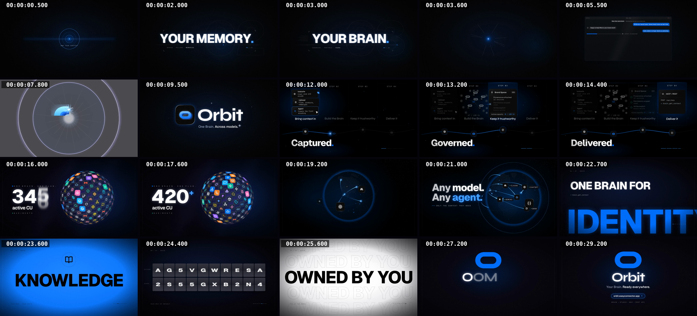
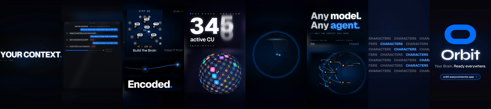

# Vitrine : le film de lancement d'Orbit

Un film de lancement de 30 secondes réalisé avec motion-mirror : image et bande-son générées par du code, sans image ni musique de tiers. [Le voir avec le son](../assets/demo-16x9.mp4) (16:9, 1280x720, 30 s).

Cette page est le storyboard du film final. C'est aussi le contrat sur lequel le skill travaille : chaque ligne ci-dessous est une marque d'une table d'événements unique qui pilote l'image et la bande-son, donc un changement de son ne re-rend jamais une image.

## Découpage des plans

| # | Temps (s) | Scène | Image | Mots à l'écran | Son |
|---|---|---|---|---|---|
| 1 | 0,00 à 3,45 | Accroche | Un anneau et un trait de lumière s'ouvrent, puis trois mots tombent un par temps | YOUR CONTEXT, YOUR MEMORY, YOUR BRAIN | Une nappe avec un impact sur chaque mot (1,90 s, 2,83 s) |
| 2 | 3,45 à 3,80 | Effondrement | Le trait s'effondre en un point de lumière | aucun | La nappe s'éteint |
| 3 | 3,80 à 7,50 | Chat | Un chat IA générique oublie la marque à chaque nouvelle conversation | « New chat, same brand. » ... « Context lost. Every new chat starts from zero. » | Un fond discret |
| 4 | 7,50 à 11,05 | Révélation | Un portail annulaire s'ouvre, la marque se construit à partir de pièces, le logo et la signature se posent et tiennent | Orbit, One Brain. Across models. | Un impact à l'ouverture, puis le fond |
| 5 | 11,25 à 15,00 | Pipeline | Quatre étapes, une colonne chacune : sources, mémoires, provenance, livraison en MCP et REST | Captured. Encoded. Governed. Delivered. | Un tic à chaque étape ; l'orbe s'ouvre en portail annulaire |
| 6 | 15,00 à 18,00 | Capacité | Un compteur défile de 000 à 420 à côté d'une sphère de tuiles de services qui tourne | 420+ active CU | Des tics avec le compte, une cloche sur le signe plus |
| 7 | 18,00 à 22,30 | Modèles | La sphère devient des points de lumière puis un globe pointillé entouré de modèles | Any model. Any agent. Any app. | Une demi-seconde de coupure dans les basses, puis un fond aérien |
| 8 | 22,30 à 25,32 | Mots cinétiques | Six coupes sur six images : un mot géant recadré, des rangées en écho, une plaque d'accent, des rangées inclinées, un tableau à palettes, une grille de mots | IDENTITY, BRAND GUIDELINES, KNOWLEDGE, PRODUCTS, MCP SERVER + REST API, CHARACTERS | Une montée à travers les mots, un coup à chaque coupe |
| 9 | 25,32 à 26,35 | Owned | Les deux lignes de la promesse, puis des sous-temps rapides : plaques blanche et d'accent, gros plans, un glitch | OWNED BY YOU | Le plus gros coup du film sur le voile gris (26,25 s) |
| 10 | 26,35 à 30,00 | Final | La marque se trace puis se remplit, le mot se décode, un lien cerné, un pied de page mono, un fondu | Orbit. Your Brain. Ready everywhere. | Une queue qui s'éteint |

## Marques

Tout le film est découpé sur ces marques, en secondes (60 images par seconde) :

`hook` 0,00 · `hookMemory` 1,90 · `hookBrain` 2,83 · `collapse` 3,45 · `chat` 3,80 · `reveal` 7,50 · `define` 8,80 · `dive` 11,05 · `pipeline` 11,25 · `price` 15,00 · `anyModel` 18,00 · `marquee` 22,30 · `owned` 25,32 · `outro` 26,35 · `end` 30,00

## Formats

Le master 16:9 a une version 9:16 faite avec les mêmes marques et la même bande-son. Elle est recomposée par fenêtres animées, jamais recadrée : une fenêtre pour un sujet unique, des fenêtres empilées pour les plans larges, un fond flou derrière pour qu'aucune fenêtre ne flotte sur du noir, et le chat redessiné en proportions portrait.

Scène par scène, le processus a suivi le [pipeline](../skills/motion-mirror/references/pipeline.md) du skill : plan de coupes, table d'événements, une scène à la fois, paquet de preuves, verrouillage, assemblage, déclinaisons.
